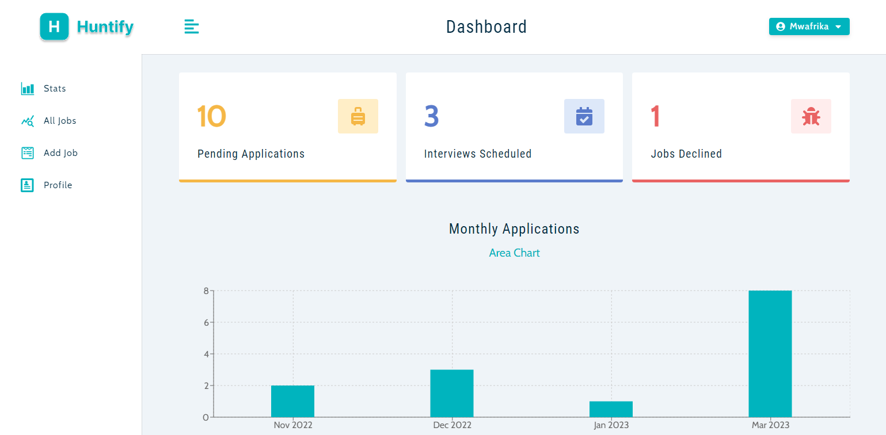
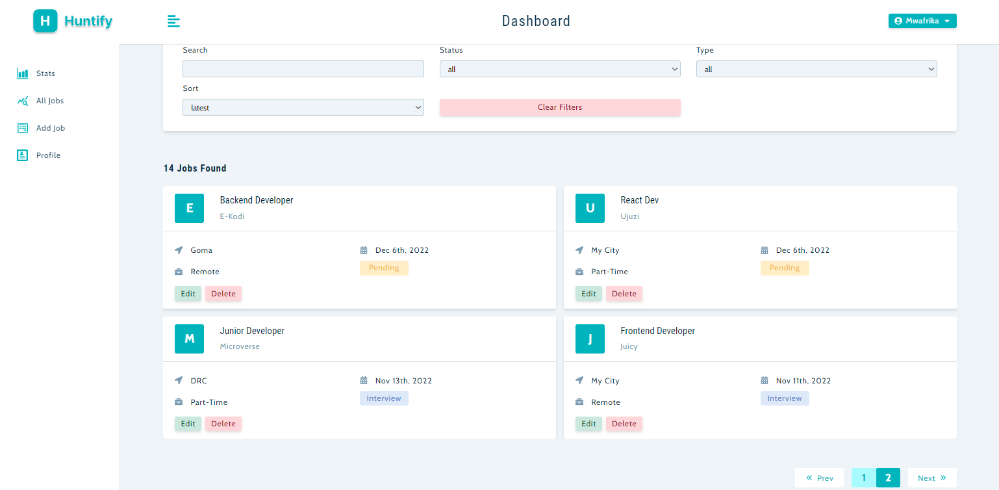
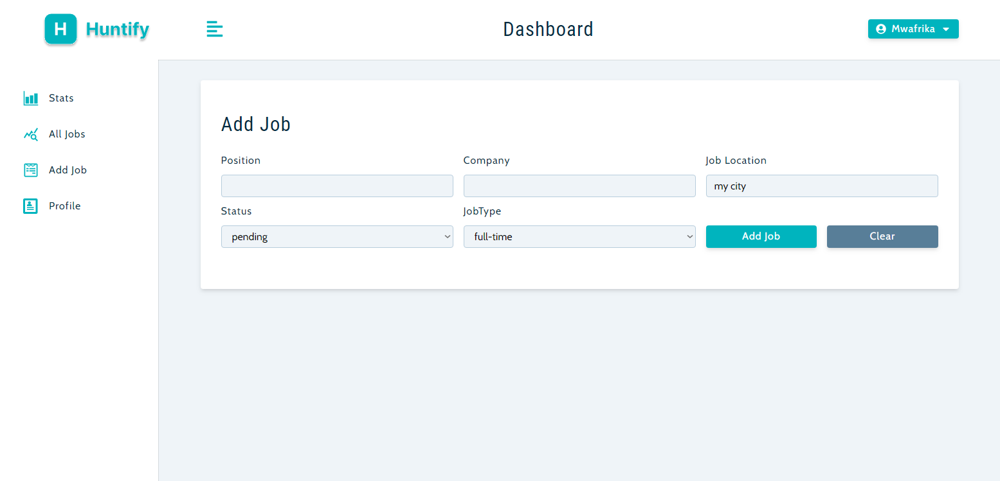
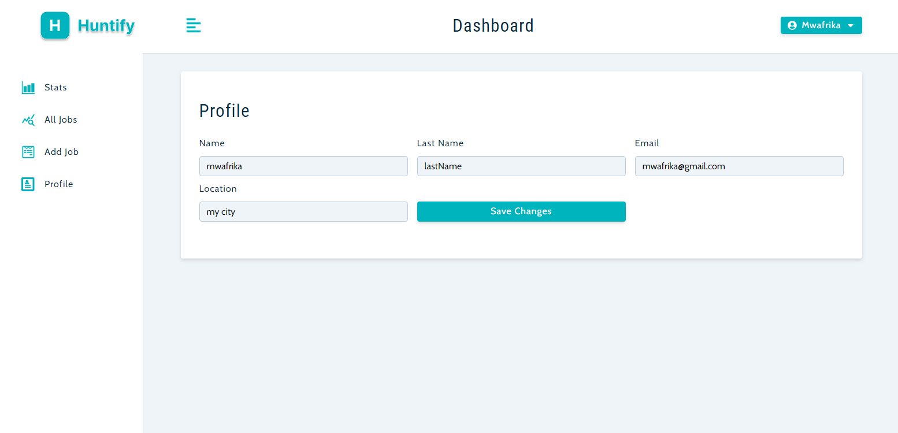

# Huntify App

## Description

> Huntify Tracks your job applications and keep your job search organized, all in one place. No more spreadsheets, no more emails,no more lost job applications.

## Built With

- React
- Express
- Context API
- Styled-component
- MongoDB
- Node.js

## Login

- email: `mwafrika@gmail`
- password: `123456`

## Live Demo

### [Netlify](https://huntify.netlify.app)
### [Render](https://huntify-me.onrender.com)

## Screenshots
### 1. Homepage

### 2. All jobs with pagination and filters

### 3. Add a new job

### 4. User Profile

## Author

👤 **Mwafrika Josue**

- GitHub: [@mwafrika](https://github.com/mwafrika)
- Twitter: [@mwafrika](@mwafrikamufung1)
- LinkedIn: [Mwafrika Mufungizi](https://www.linkedin.com/in/mwafrika-mufungizi/)
- Portfolio: [Mwafrika](https://mwafrika.netlify.app/)

## Show your support

Give a ⭐️ if you like this project!

## Acknowledgements

- Thanks to everyone who will get time to check this project especially to recruiters.

## 📝 License

This project is [MIT](./MIT.md) licensed.
