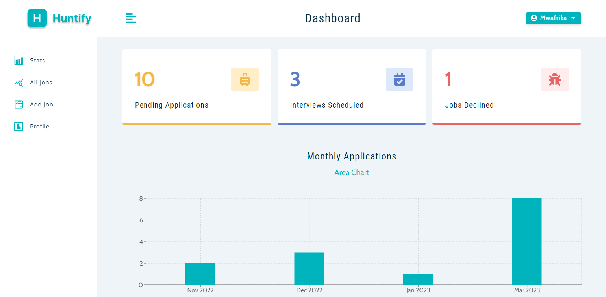
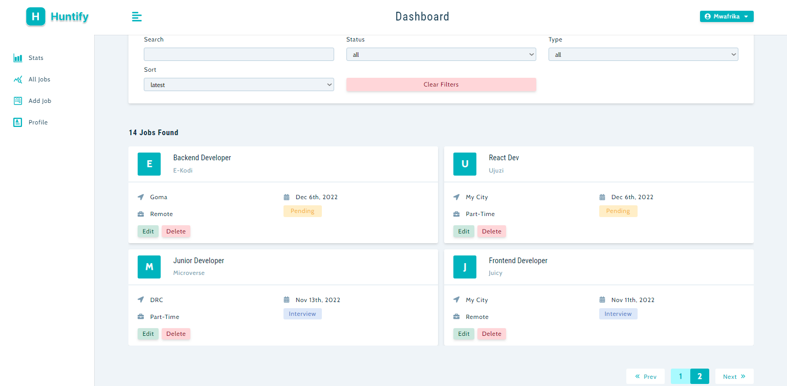
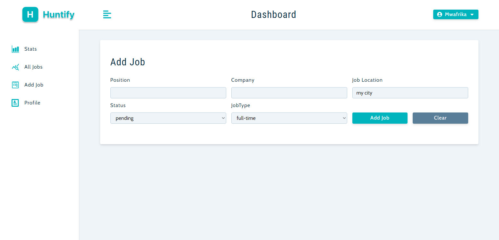
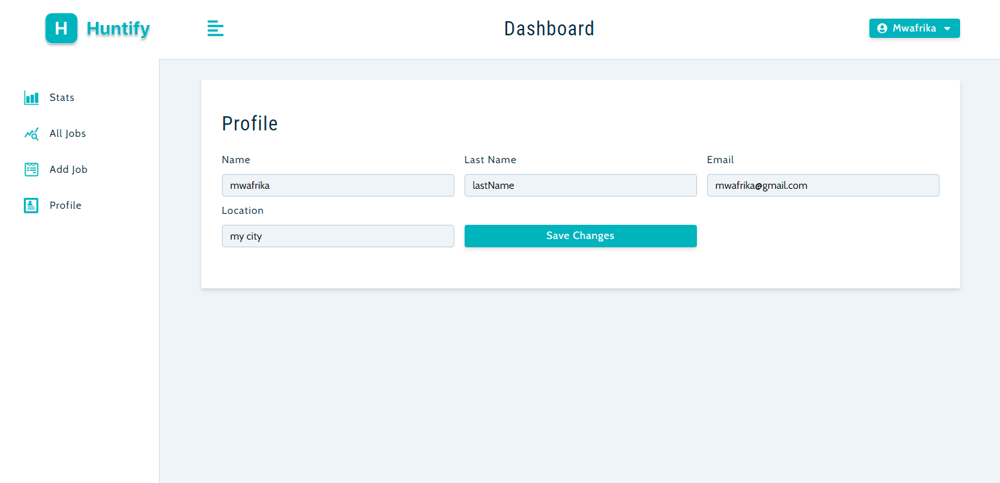

# Huntify App

## Description

> Huntify is a full-stack job application tracker designed to help job seekers
> manage their applications, track progress, and organize their job search in one place.

## Why I Built It

Keeping track of applications across spreadsheets, emails, and browser tabs
becomes difficult as the number of applications grows. Huntify centralizes
that workflow into a single application.

## My Contribution

I designed and implemented the application, including:

- REST API and route structure
- Authentication and authorization
- Job/application CRUD workflows
- MongoDB data models
- Backend middleware and error handling
- Frontend state management
- Filtering and pagination
- Deployment configuration

## Tech Stack

- React
- Node.js
- Express
- MongoDB / Mongoose
- Context API
- Styled Components

## Architecture

```text
                ┌──────────────────┐
                │   React Client   │
                │                  │
                │ Context API      │
                │ Components       │
                │ Pages            │
                └────────┬─────────┘
                         │ HTTP
                         ▼
                ┌──────────────────┐
                │   Express API    │
                │                  │
                │ Routes           │
                │ Middleware       │
                │ Controllers      │
                │ Error handling   │
                └────────┬─────────┘
                         │
                         ▼
                ┌──────────────────┐
                │ MongoDB/Mongoose │
                │                  │
                │ User             │
                │ Job/Application  │
                └──────────────────┘

The backend is organized around controllers, routes, models,
middleware, database access, and reusable utilities.
```
## Live Demo

### [Frontend – Netlify ](https://jobify-mev2.netlify.app/)
### [Backend – Render](https://jobify-mev2.onrender.com/)


## Screenshots
### 1. Homepage

### 2. All jobs with pagination and filters

### 3. Add a new job

### 4. User Profile


## Getting Started
 ### Prerequisites
 - Node.js
 - MongoDB
### Installation
```bash
git clone https://github.com/mwafrika/jobifyMev2.git
cd jobifyMev2
npm install
```
### Running the app
Add the required environment variables, then start the application.
```bash
npm run dev
```
### Project Structure
```bash
client/
  ...
controllers/
  ...
models/
  ...
routes/
  ...
middleware/
  ...
db/
  ...
errors/
  ...
utils/
  ...
```
## Author

👤 **Mwafrika Josue**

- GitHub: [@mwafrika](https://github.com/mwafrika)
- Twitter: [@mwafrika](@mwafrikamufung1)
- LinkedIn: [Mwafrika Mufungizi](https://www.linkedin.com/in/mwafrika-mufungizi/)
- Portfolio: [Mwafrika](https://mwafrika.netlify.app/)

## Show your support

Give a ⭐️ if you like this project!

## Acknowledgements

- Thanks to everyone who will get time to check this project especially to recruiters.

## 📝 License

This project is [MIT](./MIT.md) licensed.
